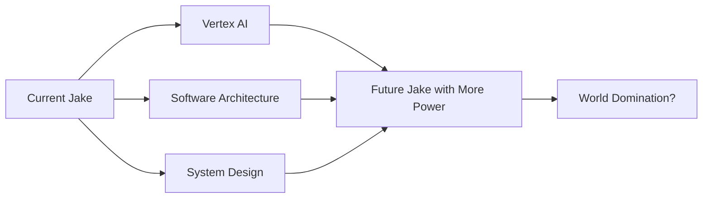

<!-- Animated Header -->
<div align="center">
  
</div>

<!-- Typing Animation -->
<p align="center">
  <a href="https://git.io/typing-svg">
    
  </a>
</p>

<!-- Cool ASCII Art Banner -->
```
     ██╗ █████╗  ██████╗ ██████╗ ██████╗
     ██║██╔══██╗██╔════╝██╔═══██╗██╔══██╗
     ██║███████║██║     ██║   ██║██████╔╝
██   ██║██╔══██║██║     ██║   ██║██╔══██╗
╚█████╔╝██║  ██║╚██████╗╚██████╔╝██████╔╝
 ╚════╝ ╚═╝  ╚═╝ ╚═════╝ ╚═════╝ ╚═════╝
```

<!-- Profile Views & Badges -->
<p align="center">
  
  
  
</p>

<!-- Animated Divider -->
<div align="center">
  
</div>

## 🎮 About Me - The Dev Behind the Keyboard

Hey! I'm **Jacob Matthew Cael Rafal**, but you can call me Jake! I'm that guy who gets way too excited about neural networks and can debate the merits of different activation functions over coffee (speaking of which, I'm probably on my 5th cup today ☕).


### Quick Facts About Me 🎯
- 🏢 **Currently:** Crafting AI magic at **Sevron Ltd** in Makati City 🇵🇭
- 🎓 **Achievement Unlocked:** Survived college with Latin Honors (and excessive caffeine)
- 🌍 **Working with:** Awesome people from around the globe
- 🎵 **Coding Soundtrack:** Lo-fi hip hop beats (like everyone else, I know...)
- 🎮 **Fun Fact:** I debug by explaining my code to my rubber duck named "Stack Overflow"
- 🍕 **Pizza vs Tabs:** Pizza always, tabs in code (fight me!)
- 💬 **Favorite Quote:** "It works on my machine" - Every developer ever

### Random Dev Fact Generator 🎲
```javascript
const facts = [
  "I once spent 3 hours debugging, only to realize I forgot a semicolon",
  "My commit messages are 50% emojis, 50% actual description",
  "I've googled 'how to center a div' more times than I'd like to admit",
  "My code is powered by Stack Overflow and determination",
  "I believe arrays should start at 0, and I'll die on this hill"
];
// Today's fact: ${facts[new Date().getDay() % facts.length]}
```

<!-- Animated Divider -->
<div align="center">
  
</div>

## 🔭 What I'm Up To These Days

- 🤖 **Building AI solutions** that actually solve real problems (not just another chatbot)
- 🧪 **Experimenting with** the latest LLMs and seeing what breaks
- 📚 **Learning** Vertex AI because why not add another tool to the arsenal?
- 🎯 **Optimizing** everything that doesn't move (and some things that do)
- ☕ **Converting** coffee into code at an alarming rate
- 🌱 **Growing** my GitHub garden one commit at a time

<!-- Animated Coding GIF -->
<div align="center">
  
</div>

## 🛠️ Cool Stuff I've Built (My Digital Children)

<details open>
<summary><b>🚀 Click to explore my projects!</b></summary>
<br>

### 🧙‍♂️ **LOKI** - AI Learning Experience Generator
> *Because who doesn't want a Norse god generating their learning content?*
- 🎯 **What it does:** Creates personalized AI-powered learning experiences
- 🛠️ **Built with:** Python, LangChain, OpenAI GPT-4, Next.js
- 🎨 **Cool feature:** Adapts content difficulty based on user progress
- 📊 **Status:** Making education fun again!

---

### ⚡ **ODIN** - Workforce Management Platform
> *All-father of workforce solutions (see what I did there?)*
- 🎯 **What it does:** Manages your workforce so you don't have to
- 🛠️ **Built with:** React, Node.js, PostgreSQL, Docker
- 🎨 **Cool feature:** Real-time analytics dashboard that actually makes sense
- 📊 **Status:** Helping managers sleep better at night

---

### 📚 **ATLAS** - Safety Data Sheet Automation
> *Holding up the world of safety compliance*
- 🎯 **What it does:** Automates the mind-numbing task of SDS management
- 🛠️ **Built with:** Python, TensorFlow, OCR magic, AWS
- 🎨 **Cool feature:** Extracts data from PDFs faster than you can say "OSHA"
- 📊 **Status:** Saved countless hours of manual data entry

---

### 🎩 **RizalAI** - Historical Figure Chatbot
> *Talk to José Rizal like it's 1896!*
- 🎯 **What it does:** Chat with the Philippines' national hero
- 🛠️ **Built with:** Python, Gradio, Fine-tuned LLM, Historical datasets
- 🎨 **Cool feature:** Historically accurate responses (mostly!)
- 📊 **Status:** Making history classes jealous

---

### 🎯 **tagumpAI** - Career Guidance Mobile App
> *Your pocket career counselor (minus the judgment)*
- 🎯 **What it does:** Provides AI-powered career guidance for students
- 🛠️ **Built with:** React Native, Python, ML models, Firebase
- 🎨 **Cool feature:** Personality-based career matching algorithm
- 📊 **Status:** Helping Gen Z figure out their lives

---

### 🗣️ **Ilokano-Tagalog Translator** - Thesis Project
> *My academic baby that actually worked!*
- 🎯 **What it does:** Bridges the language gap in the Philippines
- 🛠️ **Built with:** Python, NLP models, Blood, sweat, and tears
- 🎨 **Cool feature:** Context-aware translations
- 📊 **Status:** Got me that sweet, sweet diploma!

</details>

<!-- Tech Stack Section -->
## 🧰 My Toolbox - The Arsenal

<details open>
<summary><b>🎨 Click to see what's in my tech stack!</b></summary>
<br>

### 👨‍💻 Languages I Speak (To Computers)


### 🤖 AI/ML Magic Spells


### 🛠️ Tools That Make Life Easier


### ☁️ Cloud Platforms I've Conquered


</details>

<!-- GitHub Stats -->
## 📊 GitHub Stats - The Numbers Game

<div align="center">

  <!-- GitHub Stats Card -->
  

  <!-- Most Used Languages -->
  

</div>

<div align="center">

  <!-- GitHub Streak Stats -->
  

</div>

<!-- Contribution Graph Snake -->
<div align="center">
  <picture>
    <source media="(prefers-color-scheme: dark)" srcset="https://raw.githubusercontent.com/JakeCob/JakeCob/output/github-contribution-grid-snake-dark.svg">
    <source media="(prefers-color-scheme: light)" srcset="https://raw.githubusercontent.com/JakeCob/JakeCob/output/github-contribution-grid-snake.svg">
    
  </picture>
</div>

<!-- Activity Graph -->
[](https://github.com/ashutosh00710/github-readme-activity-graph)

## 🌱 Currently Learning - The Never-Ending Journey

<div align="center">



</div>

- 🧠 **Vertex AI** - Because Google's AI platform looks shiny
- 🏗️ **Software Architecture** - Making my code less spaghetti-like
- 🔧 **System Design** - Learning to draw boxes and arrows professionally
- 🎯 **LLM Fine-tuning** - Teaching AI to be as sarcastic as me
- 🚀 **Edge Computing** - Bringing AI to your toaster

## 🎮 Fun Zone - Where Productivity Goes to Die

### 📱 Daily Dev Joke
<div align="center">
  
</div>

### 🎵 Currently Vibing To
```yaml
Current_Playlist: "lofi hip hop radio - beats to code/debug to"
Mood: "In the zone 🎯"
Coffee_Level: "Dangerously caffeinated ☕☕☕☕☕"
Bug_Count_Today: 42 (the answer to everything)
```

### 🎲 Random Dev Wisdom
> "Any fool can write code that a computer can understand. Good programmers write code that humans can understand... and then comment it out because it's too slow." - Not Martin Fowler

### 🏆 Achievements Unlocked
- 🐛 **Bug Hunter**: Found a bug in production on a Friday at 5 PM
- 🔥 **Commit Streak**: 30 days without breaking main branch
- 🎯 **Merge Master**: Resolved a 3-way merge conflict without crying
- 📝 **Documentation Hero**: Actually wrote documentation (once)
- ⚡ **Speed Runner**: Fixed a critical bug in under 10 minutes

## 💬 Let's Connect! - Don't Be a Stranger!

<div align="center">

[](https://www.linkedin.com/in/jacob-matthew-rafal-b94399217/)
[](mailto:rafaljacobmatthew@gmail.com)
[](https://github.com/JakeCob)

</div>

### 📢 Open for:
- 🤝 **Collaborations** on AI/ML projects that actually matter
- ☕ **Virtual Coffee Chats** about tech, life, and why Python > Java
- 🧠 **Brain-storming Sessions** for your next big idea
- 🎮 **Code Reviews** where we roast each other's code (constructively)
- 📚 **Knowledge Sharing** because gatekeeping is so 2010

## 🎬 Before You Go...

<div align="center">

### Thanks for dropping by! Here's a virtual coffee for you ☕


**"Always down for a virtual coffee chat about tech, AI, or why tabs are superior to spaces!"**

---

### 📈 Visitor Count - You're Awesome Visitor #


---


</div>

<!-- Easter Egg -->
<!--
████████████████████████████████████████████████████████████
█─█─█▄─▄██▄─▄▄▀█▄─▄▄▀█▄─▄▄─█▄─▀█▄─▄███▄─▄▄─█─▄▄─█─▄▄─█████
█─▄─██─███─██─██─██─██─▄█▀▀██─█▄█─█████─▄█▀█─██─█─██─█████
▀▄▀▄▀▄▄▄▀▀▄▄▄▄▀▀▄▄▄▄▀▀▄▄▄▄▄▀▄▄▄▀▄▄▄▀▀▀▄▄▄▄▄▀▄▄▄▄▀▄▄▄▄▀▀▀▀
If you found this, you're a true code explorer! 🎉
Here's a cookie: 🍪
-->
